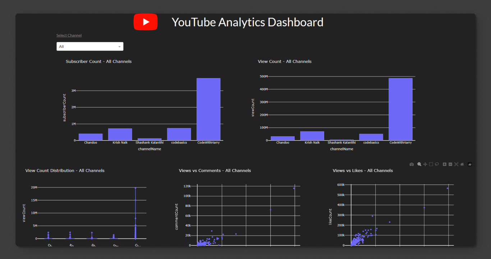

# YouTube Data Analysis using API

This is a repository for analyzing data about popular Data Science YouTube channels. It uses libraries such as __Pandas__, __Matplotlib__, and __nltk__ (natural language toolkit) among others. It also defines several functions to retrieve various data about the YouTube channels using the __YouTube Data API v3__, such as subscriber counts, video views, video titles, video upload schedules, and more. After collecting this data, several visualizations and analysis are performed to understand how the channels differ in terms of subscriber and view counts, video popularity, engagement, and other metrics. It also retrieves comments from some of the videos using the YouTube API, which are then used to create a word cloud of frequently used words. Finally, a dashboard is made using __plotly dash__ using __dash bootstrap components__. Below is a screenshot of the dashboard.

Overall, this repositoy is useful for those who want to learn using YouTube API to retrieve data for analysis as well as setup a plotly dash app to showcase a dashboard of the analysed data.

<a target="_blank" href="https://youtube-dashboard.onrender.com/"> YouTube Analytics Dashboard</a>
